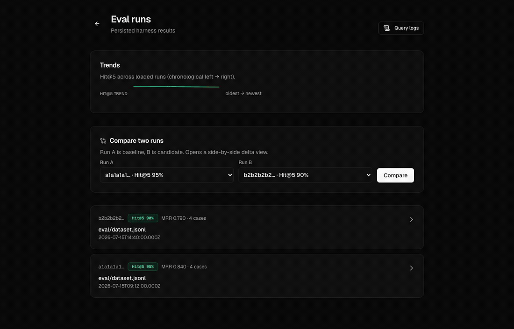
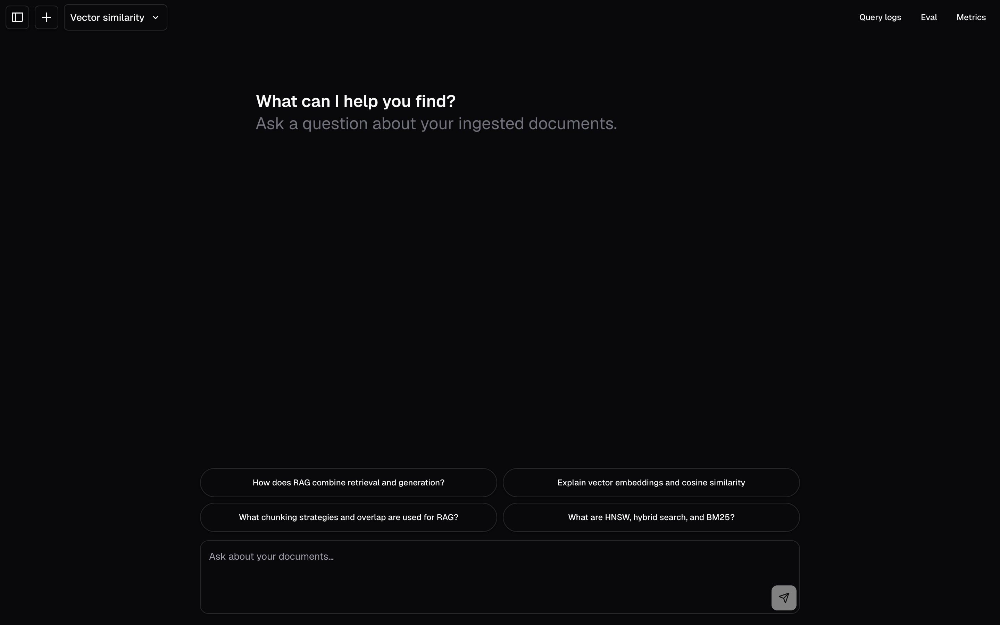
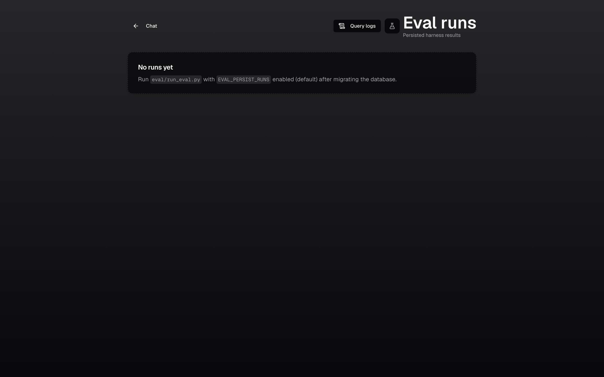
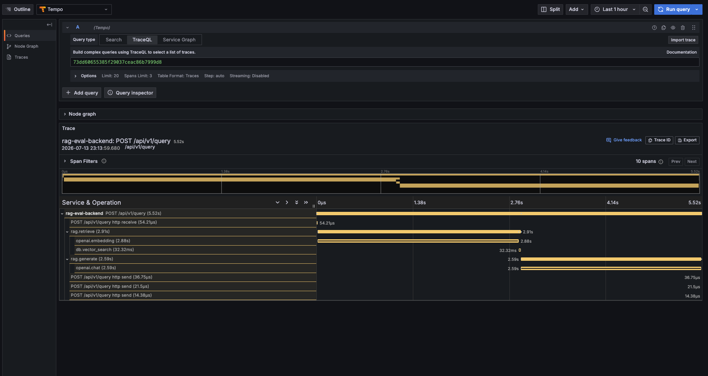

<div align="center">

# RAG Eval Observability

**Chat over your documents — then persist offline evals, compare runs by `case_id`, and trace every answer in the query log. One repo you can deploy.**

[](https://pob-rag-chat.xyz/)
[](https://github.com/Padraigobrien08/rag-eval-observe/actions/workflows/ci.yml)
[](https://github.com/Padraigobrien08/rag-eval-observe/actions/workflows/eval-gate.yml)
[](https://github.com/Padraigobrien08/rag-eval-observe/actions/workflows/ci.yml)
[](https://github.com/Padraigobrien08/rag-eval-observe/releases)
[](https://opensource.org/licenses/MIT)
[](https://www.typescriptlang.org/)
[](https://www.python.org/)


### [Try the live demo →](https://pob-rag-chat.xyz/)

_Seeded with sample RAG documents — click an example query to see retrieval, citations, and per-answer latency/cost immediately._

</div>

## Why this exists

Most RAG demos stop at chat. This one is built to **close the loop**: change the system → measure the same dataset → see **what regressed, why, and where to look in production traces**.

- **💬 Grounded chat** — answers cite their retrieved sources, with per-message latency, cost, tokens, and a link straight to the query-log trace.
- **🧪 Persisted eval runs** — every `eval/run_eval.py` completion lands in Postgres with a stable ID. List runs → drill into a run → **compare two runs keyed by `case_id`** (not fragile row order), with per-metric deltas and highlighted Hit@5 flips.
- **🔍 Query-log explorer** — live traffic and eval failures share one mental model via `query_log_id`, so a regression in CI points at the same rows you can inspect in production.
- **📤 Eval-as-code** — export JSON/CSV with `curl` patterns ([docs/EVAL_CI.md](./docs/EVAL_CI.md)) so pipelines can archive artifacts and gate merges.

The full product argument is in **[docs/THESIS.md](./docs/THESIS.md)**.

## Retrieval strategies, measured

The repo ships four retrieval strategies. Rather than assert which is "best," it **measures** them — the same harness that gates CI produces this table. Run it yourself with `uv run python eval/benchmark_strategies.py`.

| Strategy            | Hit@1 |     Hit@5 |       MRR | Retrieval latency p50 / p95 | Cost / 1k queries | OpenAI calls (embed / chat) |
| ------------------- | ----: | --------: | --------: | --------------------------: | ----------------: | --------------------------: |
| `vector-similarity` | 76.9% |     94.9% | **0.840** |             227 ms / 331 ms |           $0.0002 |                     1 / 0.0 |
| `hybrid-search`     | 75.6% |     94.9% |     0.825 |             220 ms / 292 ms |           $0.0002 |                     1 / 0.0 |
| `reranking`         | 73.1% | **98.7%** |     0.831 |           1119 ms / 1599 ms |           $0.2361 |                     1 / 1.0 |
| `multi-query`       | 73.1% |     94.9% |     0.827 |           2089 ms / 2906 ms |           $0.0372 |                     4 / 1.0 |

_78-case bundled corpus, `text-embedding-3-small` + `gpt-4o-mini`, `top_k=8`. Retrieval-stage latency and cost only (generation is strategy-independent). Cost is measured OpenAI token usage at current public rates. Reproduce: [docs/BENCHMARKS.md](./docs/BENCHMARKS.md)._

The point isn't a leaderboard — it's that **"which retriever should I use?" is a question you answer with numbers from your own corpus.** And there's no free lunch: on this corpus plain vector similarity has the **best MRR and top-1 precision** and is **~1000× cheaper** than reranking; reranking buys **+3.8pp Hit@5 recall for ~5× the latency** (it reshuffles the top-k, helping recall but _hurting_ Hit@1); multi-query doesn't pay off at all. Change the embeddings, chunking, or `top_k` and these move — so you re-measure.

## See it catch a regression

A RAG system rarely _breaks_ — it quietly _degrades_. This repo makes that a **merge-blocking CI check**, the same way a failing unit test is.

In [a worked case study](./backend/eval/case_study/README.md), ingesting four broad "summary" docs demotes the canonical source for 12 questions. **Hit@5 barely moves — a recall@k-only gate would ship it — but MRR drops past tolerance and the eval gate fails the PR (`exit 1`).** Reproduce it with one script.



_The in-app compare view, keyed by `case_id`: the candidate run trips the **Regression** verdict (a gated metric past ±2pp), and expanding a flipped case shows the canonical source falling from **#1 → not retrieved** — the same signal the CI gate blocks on._

## See it in action

|                                    Grounded chat                                     |                                   Query-log explorer                                    |
| :----------------------------------------------------------------------------------: | :-------------------------------------------------------------------------------------: |
|       [](https://pob-rag-chat.xyz/)        | [](https://pob-rag-chat.xyz/query-logs) |
|                               **Persisted eval runs**                                |                                   **System metrics**                                    |
| [](https://pob-rag-chat.xyz/eval/runs) |     [](https://pob-rag-chat.xyz/metrics)      |

_Screenshots from the live deployment — click any to open it. The chat streams from the FastAPI RAG backend; the observability pages read the same Postgres._

## Trace every answer

A RAG answer is a **pipeline, not a single call**. Every request emits an OpenTelemetry trace — one span per stage — so you can see exactly where latency and cost go, per request.

[](./docs/OBSERVABILITY.md)

_A 5.5s answer, decomposed: retrieval was 2.9s (**all** query embedding; the pgvector search was 32ms) and generation was 2.6s (all the LLM). A single `latency_ms` number would only say "slow" — the trace says "two OpenAI calls, not your retrieval." Different fix._

Latency **percentiles (p50/p95/p99) per route and per pipeline stage** are exposed at `/metrics` and as Prometheus histograms for `histogram_quantile()` in Grafana. Bring the whole trace stack (Tempo + Prometheus + Grafana) up with one command — see **[docs/OBSERVABILITY.md](./docs/OBSERVABILITY.md)**.

## Quick start

Docker Compose brings up Postgres, the FastAPI backend, and the web app together:

```bash
git clone https://github.com/Padraigobrien08/rag-eval-observe.git
cd rag-eval-observe
cp .env.example .env
# edit .env: set OPENAI_API_KEY=sk-...

# Postgres + FastAPI + web. The web container applies both migration sets
# (backend RAG tables + Drizzle chat/auth tables) before it starts.
docker compose --profile full up -d

curl http://localhost:8000/api/v1/health   # verify the backend
```

Then open **http://localhost:3000**. For the full contributor workflow — hot-reload servers, migrations, seeding, tests, Playwright, Alembic — see **[DEVELOPMENT.md](./docs/DEVELOPMENT.md)**. For every environment variable, see **[ENV_VARS.md](./docs/ENV_VARS.md)**.

## Architecture

```
┌─────────────────────────────────────────────────────────┐
│                    Next.js Frontend                      │
│  (React 19, TypeScript, Tailwind v4, shadcn/ui,         │
│   AI SDK v5 — streams from the backend, not an LLM)     │
└────────────────────┬────────────────────────────────────┘
                     │ HTTP / server-side proxy
┌────────────────────▼────────────────────────────────────┐
│                  FastAPI Backend                         │
│  ┌──────────────┐  ┌──────────────┐  ┌──────────────┐  │
│  │ RAG pipeline │  │  Eval harness│  │ Observability│  │
│  │ (4 retrievers)│  │  + gate      │  │ (OTel + /metrics) │
│  └──────────────┘  └──────────────┘  └──────────────┘  │
└────────────────────┬────────────────────────────────────┘
                     │ SQL + pgvector
┌────────────────────▼────────────────────────────────────┐
│         PostgreSQL — documents, chunks + embeddings,     │
│         chat, eval_runs, query logs (one source of truth)│
└─────────────────────────────────────────────────────────┘
```

**Frontend** — Next.js 15 (App Router), React 19, TypeScript, Tailwind v4 + shadcn/ui + AI Elements, AI SDK v5 (`useChat`), Auth.js (guest + email/password), Drizzle ORM. Started from Vercel's [Next.js AI Chatbot](https://vercel.com/templates/next.js/chatbot) template, then rebuilt around a RAG backend: the UI streams from FastAPI (it never calls an LLM directly) and adds citations, per-message observability, and the query-log / eval / metrics surfaces the template doesn't have.

**Backend** — FastAPI (Python 3.11+), PostgreSQL + pgvector, OpenAI (embeddings & chat) behind a provider-neutral [`LLMClient`](./backend/app/llm/base.py) seam, optional Redis for distributed rate limiting.

**Infra** — Docker Compose (local); the live demo runs on Vercel + Render + Neon. The backend is a standard container — deploy it anywhere (see [DEPLOYMENT.md](./docs/DEPLOYMENT.md), or [docs/AZURE_DEPLOY.md](./docs/AZURE_DEPLOY.md) for Azure Container Apps).

## API

| Endpoint            | Method | Description                                              |
| ------------------- | ------ | -------------------------------------------------------- |
| `/api/v1/health`    | GET    | Health check and database connectivity                   |
| `/api/v1/query`     | POST   | Query the RAG system (`rag_model` selects the retriever) |
| `/api/v1/ingest`    | POST   | Ingest documents (text, PDF, DOCX)                       |
| `/api/v1/documents` | GET    | List documents                                           |
| `/api/v1/eval/runs` | GET    | List / compare persisted eval runs                       |
| `/api/v1/metrics`   | GET    | Latency percentiles per route + stage                    |

Interactive OpenAPI docs at `http://localhost:8000/docs`. Full contract: [docs/API_CONTRACT.md](./docs/API_CONTRACT.md) · [backend/README.md](./backend/README.md).

```bash
curl -X POST http://localhost:8000/api/v1/query \
  -H "Content-Type: application/json" \
  -d '{"query": "What is RAG?", "top_k": 8, "rag_model": "vector-similarity"}'
```

`rag_model` ∈ `vector-similarity` · `hybrid-search` · `reranking` · `multi-query` (see the [benchmark table](#retrieval-strategies-measured)).

## Documentation

**[docs/README.md](./docs/README.md) is the full index.** The essentials:

- **Get started** — [Quick start](#quick-start) · [DEVELOPMENT.md](./docs/DEVELOPMENT.md) · [ENV_VARS.md](./docs/ENV_VARS.md)
- **Understand it** — [docs/THESIS.md](./docs/THESIS.md) (the product argument) · [docs/BENCHMARKS.md](./docs/BENCHMARKS.md) · [docs/OBSERVABILITY.md](./docs/OBSERVABILITY.md) · [docs/API_CONTRACT.md](./docs/API_CONTRACT.md)
- **Ship & operate** — [DEPLOYMENT.md](./docs/DEPLOYMENT.md) · [docs/RUNBOOK.md](./docs/RUNBOOK.md) (health, incidents, SLOs) · [docs/HARDENING.md](./docs/HARDENING.md) (`API_KEY`, threat model) · [docs/EVAL_CI.md](./docs/EVAL_CI.md)
- **Contribute** — [CONTRIBUTING.md](./CONTRIBUTING.md) · [CODE_OF_CONDUCT.md](./CODE_OF_CONDUCT.md) · [CHANGELOG.md](./CHANGELOG.md)

## Security

The backend ships an **API-key gate** (`optional_api_key_middleware`). The recommended posture for any public deployment — including the live demo — is the **trusted-proxy pattern**: set `API_KEY` on the backend and the same value as `BACKEND_API_KEY` on the Next.js proxy, which injects it server-side. Public visitors reach the app through the proxy (with its own guest auth + per-IP rate limits); **direct hits to the backend origin get `401`**, so billed OpenAI calls aren't openly exposed. Left empty, the backend stays open for zero-config local dev.

See **[docs/HARDENING.md](./docs/HARDENING.md)** and [SECURITY.md](./SECURITY.md) for the full posture, threat model, and multi-tenant guidance.

## Contributing

Contributions welcome — see [CONTRIBUTING.md](./CONTRIBUTING.md). The short version: fork, branch, make changes, run `make lint && make test`, open a PR. CI runs lint, typecheck, unit tests (Jest on the TypeScript logic layer + pytest on the backend, both under a coverage gate), a build, Playwright E2E (incl. axe-core accessibility), and the eval regression gate.

The coverage badge reads **backend + TypeScript logic layer**. React components are deliberately outside that denominator — they're covered by Playwright E2E and axe-core instead of unit snapshots — which is why the badge names its scope rather than claiming whole-repo coverage. See [jest.config.js](./jest.config.js) and [docs/DEVELOPMENT.md](./docs/DEVELOPMENT.md#tests).

## License

MIT — see [LICENSE](./LICENSE). Built with [Next.js](https://nextjs.org/), [FastAPI](https://fastapi.tiangolo.com/), [PostgreSQL](https://www.postgresql.org/) + [pgvector](https://github.com/pgvector/pgvector), and [shadcn/ui](https://ui.shadcn.com/).
