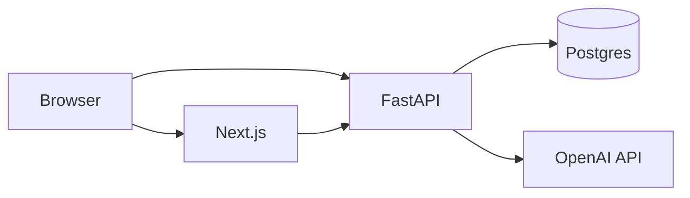

# Hardening: authz, rate limits, tenancy

This document ties **runtime behavior** to **operational choices**. It is the single place we spell out what the repo does today versus what you must add for strict multi-tenant production.

## API authentication (optional `API_KEY`)

When **`API_KEY`** is non-empty in backend settings:

- All routes except **`/`**, **`GET /api/v1/health`**, **`GET /api/v1/metrics`**, **`GET /api/v1/metrics/prometheus`**, and **OPTIONS** preflight require:
  - **`Authorization: Bearer <API_KEY>`**, or
  - **`X-API-Key: <API_KEY>`**

Implementation: `optional_api_key_middleware` in `backend/app/main.py` (keys are compared with `secrets.compare_digest`, so a wrong key can't be recovered by timing).

**Recommended posture (trusted proxy).** Set `API_KEY` on the backend and the **same value** as `BACKEND_API_KEY` on the Next.js proxy. The proxy (`src/app/api/backend/[...path]/route.ts` and `src/app/(chat)/api/chat/route.ts`) injects it server-side as `X-API-Key`, so public visitors reach the app only through the proxy — which has its own guest auth and per-IP rate limits — while **direct requests to the FastAPI origin get `401`**. This keeps billed OpenAI calls off the open internet without breaking the demo.

**Implication:** **do not** expose production keys in `NEXT_PUBLIC_*` bundles. Starting the backend with `ENVIRONMENT=production` and an empty `API_KEY` logs a warning so the open-by-default state is never silent.

## Rate limiting

- **Per-IP** limits apply to API routes (health/metrics exempt). Configure **`RATE_LIMIT_REQUESTS`** / **`RATE_LIMIT_WINDOW`**.
- Optional **Redis-backed** limiting when **`REDIS_ENABLED`** and **`REDIS_URL`** are set (`backend/app/core/rate_limit_redis.py`).

Trusted proxies should set **`X-Forwarded-For`** correctly so limits reflect client IPs, not edge nodes.

## CORS

Allowed origins come from **`CORS_ALLOW_ORIGINS`** (comma-separated). Production must list **only** your web origins.

## Multi-tenancy

**Not built in.** The data model is single-database, single-tenant by design:

- No per-organization row-level security.
- No per-user document isolation.

**Extension patterns** (you implement):

1. **Tenant id column** on `documents`, `chat_threads`, and optionally partition eval runs.
2. **JWT / OIDC** at the edge, mapping `sub` → tenant; enforce in FastAPI dependencies on every mutating route.
3. **Separate databases** per customer for the strongest isolation (ops cost highest).

## Threat model (lightweight)

Scope: default single-tenant deployment (chat + API + Postgres + optional Redis).
A starting point for security review, not a formal certification.

### Assets

| Asset                  | Risk if compromised                                          |
| ---------------------- | ------------------------------------------------------------ |
| **`OPENAI_API_KEY`**   | Abusive usage, data sent to OpenAI under your billing        |
| **`DATABASE_URL`**     | Full read/write to documents, chats, eval runs, query logs   |
| **`API_KEY`** (if set) | Unauthorized API access from any client that obtains the key |
| User chat content      | Confidentiality / compliance exposure                        |
| Uploaded PDFs / docs   | Malware storage, PII in object storage or DB                 |

### Trust boundaries

- **Browser ↔ Next:** static assets; user-visible data.
- **Browser ↔ API:** direct calls when `API_BASE_URL` points at backend (or via Next proxy `/api/backend/...`).
- **API ↔ OpenAI:** prompts, retrieved chunks, and completions leave your VPC according to OpenAI's data policies.

### Mitigations (built-in)

- **Optional API key** on mutating and sensitive read routes (see the top of this doc).
- **Rate limiting** per IP (with Redis option for multi-instance).
- **CORS** restriction to known web origins.
- **TLS** at the edge (load balancer / Vercel / ingress) — not terminated in sample Dockerfiles alone.

### Recommended additions for production

1. **Secrets management** — vault or cloud secret manager; rotate **`API_KEY`** and DB credentials.
2. **WAF / bot protection** on public API if exposed.
3. **Encryption at rest** for managed Postgres and backups.
4. **PII review** before sending user content to third-party LLMs.
5. **Dependency scanning** — `pnpm audit`, `uv` / OSV for Python.

### Out of scope (today)

- Per-user authentication and authorization.
- Field-level encryption in the database.
- Automated DLP on uploads.

## Related reading

- **[RUNBOOK.md](./RUNBOOK.md)** — incidents, health checks, and SLOs.
- **[SECURITY.md](../SECURITY.md)** — security policy and vulnerability reporting.
- **[`ENV_VARS.md`](./ENV_VARS.md)** — full variable list.
