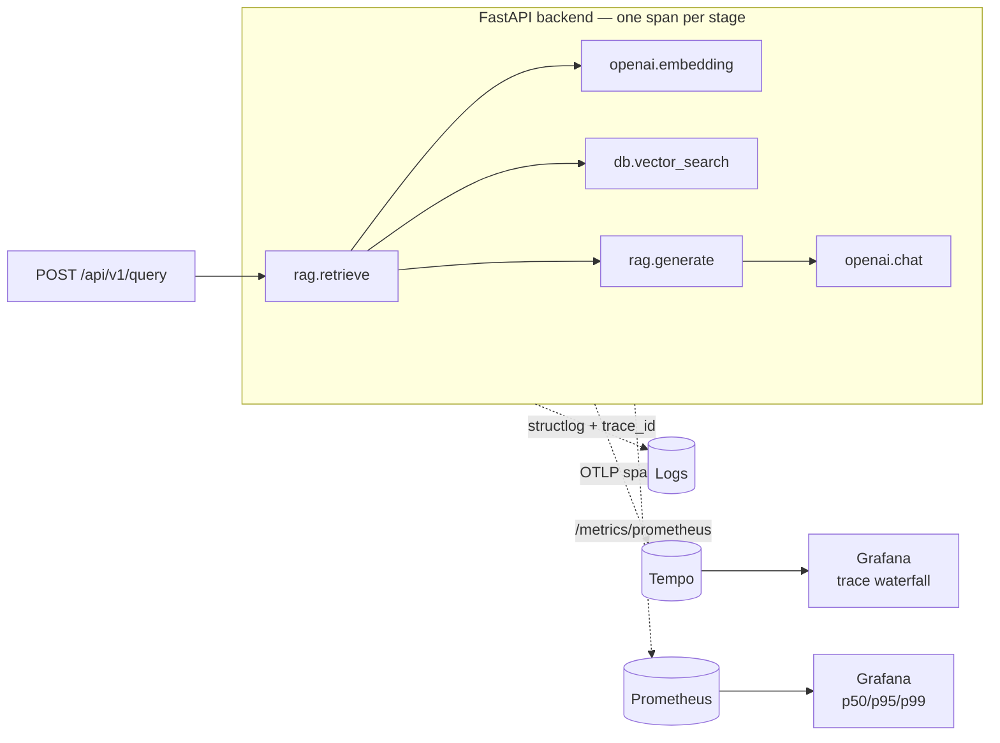
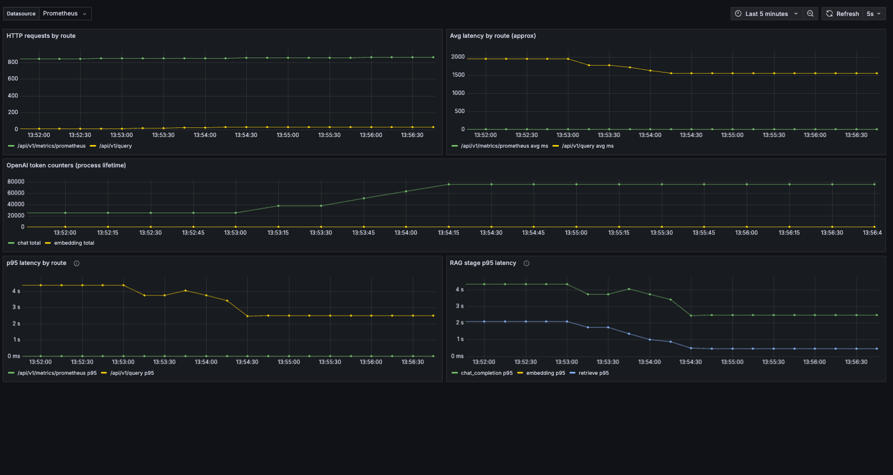
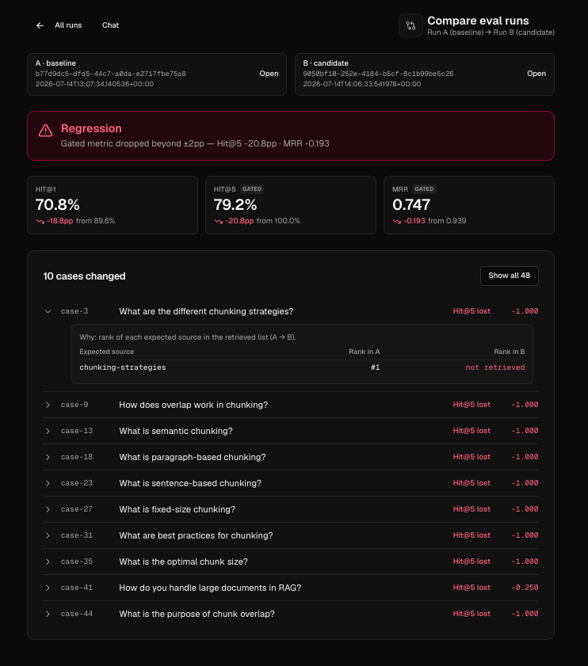

# Observability: what I built and what it revealed

> A case study in treating a RAG system like production software, not a demo.

Most RAG projects stop at "it answers questions." This one is instrumented so you
can answer the operational questions too: **where did the latency go, what did it
cost, and — when quality regresses — which request do I look at?**

There are two observability surfaces that people conflate, and this repo takes
both seriously:

1. **Offline eval** — is the system _correct_ on a known dataset? (retrieval +
   generation quality — see [BENCHMARKS.md](./BENCHMARKS.md) and [THESIS.md](./THESIS.md))
2. **Online observability** — is the system _healthy_ on live traffic right now?
   (latency, cost, errors — this doc)

The differentiator is **closing the loop between them**: eval failures and live
traffic share one id (`query_log_id` / `eval_run_id`), and every answer emits a
distributed trace you can open from the same mental model.

## The pipeline, and how it's observed

A RAG answer is a **pipeline, not a single call**. Each stage emits an
OpenTelemetry span; latency histograms and token counters are exported for
scraping; and structured logs carry the active `trace_id` so logs, traces, and
the query-audit row all correlate.



## What "expected" observability looks like — and where this went further

| Signal              | Table stakes                               | What this repo does                                         |
| ------------------- | ------------------------------------------ | ----------------------------------------------------------- |
| **Request metrics** | request count, error rate, average latency | + real **histograms** with p50/p95/p99, per route           |
| **Cost**            | total token usage                          | token counters + per-answer cost in the UI                  |
| **Logs**            | structured logs with a request id          | + `trace_id` bound in, so logs join traces                  |
| **Latency**         | one total-latency number per request       | **per-stage** spans + per-stage p95 — _where_ the time went |
| **Traces**          | (usually absent in RAG demos)              | full **pipeline trace waterfall** per request               |

The two upgrades that matter most — distributed **tracing across the pipeline**
and **real latency percentiles** — are the ones a senior reviewer notices are
missing from a "total latency: 5.5s" dashboard.

## The trace waterfall


_A 5.5s answer, fully decomposed. Retrieval was 2.9s — **all of it** the query
embedding call; the pgvector search was 32ms. Generation was 2.6s, all the LLM.
A single `latency_ms` number would only say "slow"; the trace says "two OpenAI
calls, not your retrieval or your database" — which is a completely different
fix._

Each span carries attributes you can inspect: `gen_ai.request.model`,
`gen_ai.usage.*` token counts, `finish_reason`, retrieval `top_k` and
`top_score`. Click any `openai.*` span to see exactly what it cost.

## Real percentiles, not averages

Averages hide the tail — the p99 is what your users actually complain about.
`/api/v1/metrics` exposes p50/p95/p99 **per route and per pipeline stage**, and
`/api/v1/metrics/prometheus` emits proper histogram series so
`histogram_quantile()` works directly in Grafana.



_Per-stage p95 makes "the API is slow" answerable without opening a single
trace: if `openai.chat` p95 jumps, it's the model; if `db.vector_search` p95
jumps, it's the index._

## Closing the loop with eval

The point of all this is that quality and health share one model. When
[an eval run](./BENCHMARKS.md) regresses, the compare view highlights the
`case_id` that flipped Hit@5 — and because eval turns are persisted with the
same `query_log_id` machinery as live traffic, you can trace _why_ that specific
case retrieved the wrong chunk.



_Change the system → re-run the dataset → see what regressed → click through to
the trace that explains it. That sequence — not the chatbot — is the thesis._

## Run the whole stack locally

Tracing is opt-in (`OTEL_ENABLED=true`, `uv sync --extra otel`) so the default
install stays dependency-light. One command brings up Tempo + Prometheus +
Grafana wired to the API:

```bash
export OPENAI_API_KEY=sk-...
docker compose -f docker-compose.yml -f docker-compose.observability.yml up --build
```

Then fire a query and open **Grafana → RAG Eval — Traces** at
http://localhost:3001. Full walkthrough:
[observability/grafana/README.md](../observability/grafana/README.md).

## Design notes

- **Zero-cost when off.** `app/core/tracing.py` is a thin shim: when the `otel`
  extra isn't installed, `span()` / `observe_stage()` are no-ops, so pipeline
  code calls them unconditionally without importing OpenTelemetry.
- **Percentiles agree with Grafana.** In-process quantiles use the same
  linear-interpolation-over-buckets math as Prometheus `histogram_quantile`, so
  the JSON API and the scraped dashboard report the same numbers.
- **Streaming is handled honestly.** The streaming LLM path records stage
  latency but does not hold a span open across `yield` boundaries (that can
  detach the OTel context on client disconnect); the server span still covers
  the stream.

## What's next

The natural follow-ons, in priority order:

1. **Feedback → dataset** — thumbs up/down on an answer, keyed by
   `query_log_id`, promoted into the eval dataset so production failures grow
   the test set.
2. **Online sampled judge** — run the faithfulness judge on a sample of live
   traffic and alert when it drifts below the last eval baseline.
3. **Statistically honest CI gating** — bootstrap confidence intervals over
   eval cases so a merge is blocked only on a _real_ regression, not dataset
   noise.
