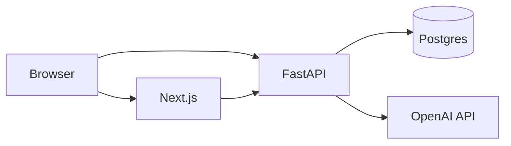

# Threat model (lightweight)

Scope: default single-tenant deployment (chat + API + Postgres + optional Redis). Use this as a starting point for security review, not a formal certification.

## Assets

| Asset | Risk if compromised |
| --- | --- |
| **`OPENAI_API_KEY`** | Abusive usage, data sent to OpenAI under your billing |
| **`DATABASE_URL`** | Full read/write to documents, chats, eval runs, query logs |
| **`API_KEY`** (if set) | Unauthorized API access from any client that obtains the key |
| User chat content | Confidentiality / compliance exposure |
| Uploaded PDFs / docs | Malware storage, PII in object storage or DB |

## Trust boundaries

- **Browser ↔ Next:** static assets; user-visible data.
- **Browser ↔ API:** direct calls when `API_BASE_URL` points at backend (or via Next proxy `/api/backend/...`).
- **API ↔ OpenAI:** prompts, retrieved chunks, and completions leave your VPC according to OpenAI’s data policies.

## Mitigations (built-in)

- **Optional API key** on mutating and sensitive read routes (see **[HARDENING.md](./HARDENING.md)**).
- **Rate limiting** per IP (with Redis option for multi-instance).
- **CORS** restriction to known web origins.
- **TLS** at the edge (load balancer / Vercel / ingress) — not terminated in sample Dockerfiles alone.

## Recommended additions for production

1. **Secrets management** — vault or cloud secret manager; rotate **`API_KEY`** and DB credentials.
2. **WAF / bot protection** on public API if exposed.
3. **Encryption at rest** for managed Postgres and backups.
4. **PII review** before sending user content to third-party LLMs.
5. **Dependency scanning** — `pnpm audit`, `uv` / OSV for Python.

## Out of scope (today)

- Per-user authentication and authorization.
- Field-level encryption in the database.
- Automated DLP on uploads.

Document your extensions in a fork or internal wiki and link them here.
